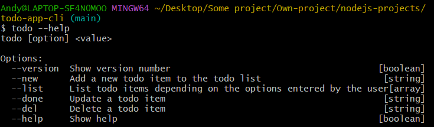
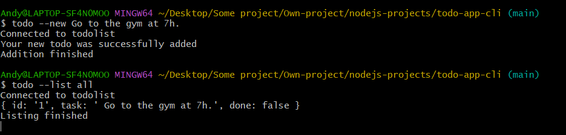
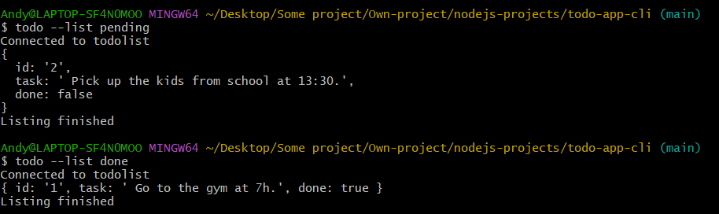
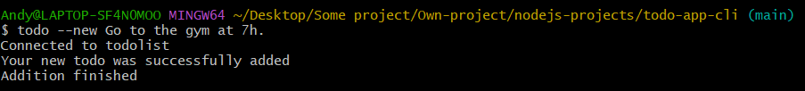
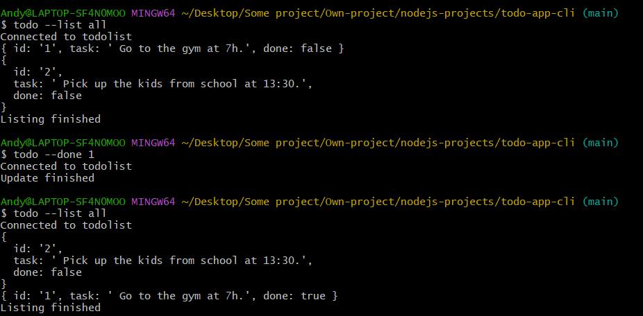
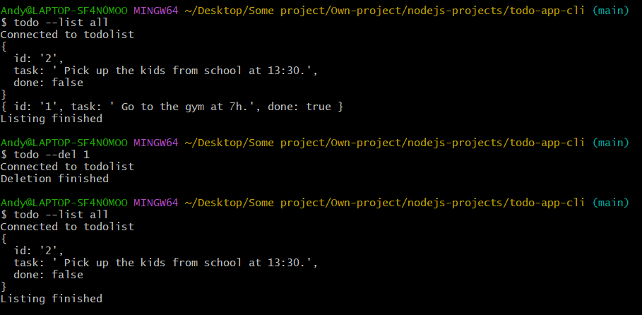

# todo-app-cli

> A CLI tool to manage your todo list from the CLI ! Made with Node.js and PostgreSQL.

# Screenshot



# Get Started

First, clone the repository and install all the packages

    git clone https://github.com/HandyyWeb/todo-app-cli.git
    npm install

Then, you can install the comand globally

    npm install -g

# Prerequisites

You need to have postgreSQL installed on your computer, for more information, see the link : [Installation](https://www.postgresql.org/download/)

Then, use your user account, your database and your password in the file bin/db/dbconnect.js file to connect to your database.

```
const pg = require('pg');

const connect = new pg.Pool({
  user: --Your user account--,
  host: 'localhost',
  database:  --Your database name--,
  password: --Your password--,
  port: 5432,
});

module.exports = { connect };

```

# Documentation

This command allows you to create a todo list and to manage it thanks to 4 options

- list [all || done || pending]
- add [value]
- del [id]
- done [id]

## List todos

Use `todo --list [all || done || pending]` to list respectively all the todos, the todos that are done and the todos that need to be done.

Example





## Add a new todo

Use `todo --new [name]` to add a new todo with the specified name to the todo list.

Example



## Update a todo

Use `todo --done [id]` to update the todo state, with the specified id.

Example



## Delete a todo

Use `todo --del [id]` to delete the todo, with the specified id.

Example



# Other libraries

pg (PostgreSQL client for Node.js) : [Node-postgres Documentation](https://node-postgres.com/)

# Contact

Andy Lebreton

E-mail : lebreton.andy@proton.me
